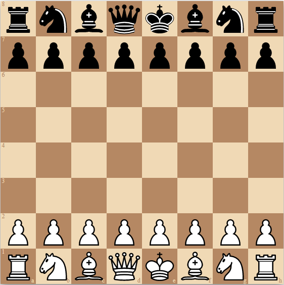

# ♟️ React Chessboard

<div align="center">


A modern, responsive chessboard component for React applications.



</div>

## ✨ Features

- 🎯 Drag and drop
- 🎨 Custom pieces
- ♟️ Spare pieces
- 🎭 Custom styling
- ✨ Animation
- 📐 Custom board dimensions
- 🔄 Event handling
- 📱 Mobile support
- 📱 Responsive
- ⌨️ Accessible
- 🔷 TypeScript support
- 🛠️ Helpful utility functions
- ✨ And more!

## 📦 Installation

```bash
pnpm add react-chessboard
# or
yarn add react-chessboard
# or
npm install react-chessboard
```

## 🚀 Quick Start

```tsx
import { Chessboard } from 'react-chessboard';

function App() {
  const chessboardOptions = {
    // your config options here
  };

  return <Chessboard options={chessboardOptions} />;
}
```

## 📚 Documentation

For detailed documentation, examples, and API reference, visit our documentation site:

[📖 View Documentation](https://react-chessboard.vercel.app/)

## 🤝 Contributing

Contributions are welcome! Please read our [contribution guide](https://react-chessboard.vercel.app/?path=/docs/developers-contributing-to-react-chessboard--docs) before submitting a Pull Request.

Keen to contribute? Here is the current list of things we want to get done / are interested in adding if there is desire for it:

### Features

- **Drag and Drop Enhancements**
  - Add `dropAnimation` prop to allow override of DragOverlay dropAnimation prop that is currently set to null. This will be for animating drag overlays back to their position on failed drops for example, instead of snapping back.
- **Accessibility Improvements**
  - Review and enhance sensor implementations and accessibility.
- **UI Customization**
  - Improve arrows so that for all Knight moves it is a right angled arrow instead of a straight one. Extending from and implementing the suggestions from an [existing PR](https://github.com/Clariity/react-chessboard/pull/128).

### Documentation

- **Framework Integrations**
  - Add framework specific documentation, Next.js, Vite, Remix
  - e.g. for Next.js, include `use client` directive at the top of the component consuming the Chessboard component.

### Infrastructure

- **Testing**
  - Add test suite full of unit tests for utils and all options stories, and visual tests
- **Storybook**
  - Upgrade to Storybook 9

## Join the community of developers

Join the community of developers on the [Discord server](https://discord.gg/mTBuwNSNn5)!

Whether you're:

- building something cool with the component and want to show it off
- struggling to implement something and need some help
- have an idea for a new feature

We'd love to have you join our growing community!

## 📄 License

MIT © [Ryan Gregory](https://github.com/Clariity)
